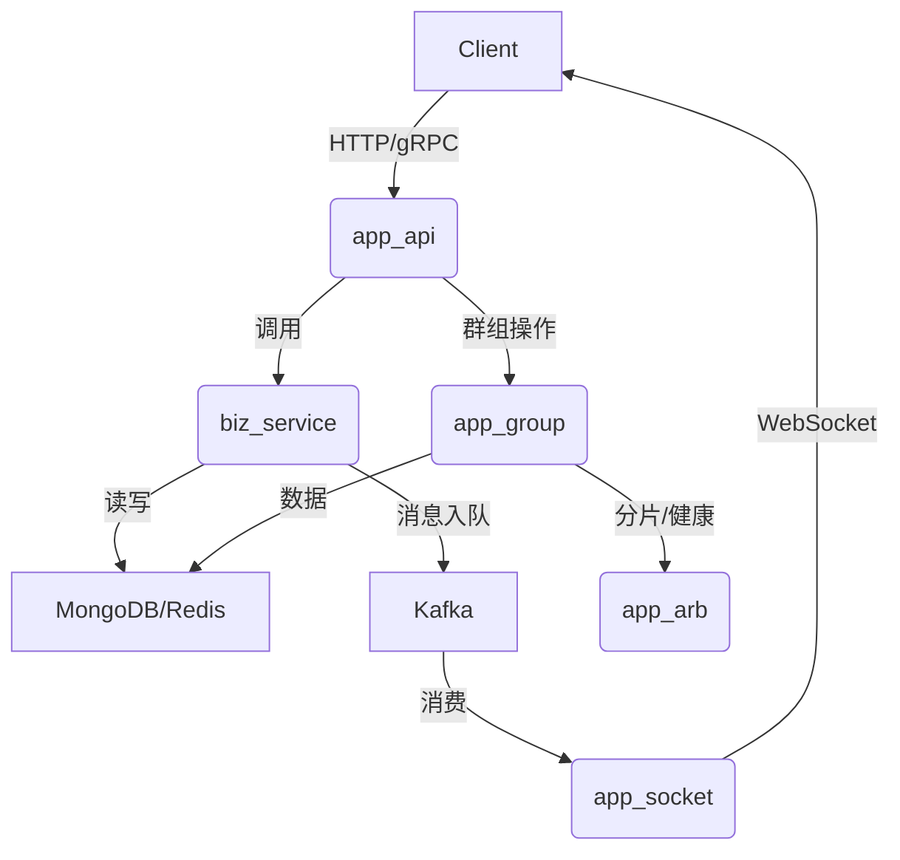

# im-server 项目详细分析

---

## 1. 顶层架构与模块职责

### 1.1 app_api
- **职责**：对外 REST/gRPC API 网关，处理用户、消息、群组等接口请求。
- **实现**：基于 actix-web，路由分发到各 handler，调用 biz_service 进行业务处理。
- **依赖**：依赖 common（配置、Redis、数据库）、biz_service（业务逻辑）、macro（宏）。

### 1.2 app_socket
- **职责**：长连接服务，负责 WebSocket/TCP 连接管理、消息实时推送、心跳检测等。
- **实现**：异步处理 socket 连接，接收/推送消息，消费 Kafka 队列，维护在线用户状态。
- **依赖**：common、biz_service。

### 1.3 app_job
- **职责**：定时任务、异步任务调度与执行（如消息清理、统计等）。
- **实现**：独立进程，定时触发任务，调用 biz_service 相关逻辑。
- **依赖**：common、biz_service。

### 1.4 app_main
- **职责**：后台管理端，聚合业务调度，通常用于管理后台或统一入口。
- **实现**：actix-web 服务，整合 swagger 文档、用户管理、认证等。
- **依赖**：common、biz_service、macro。

### 1.5 app_group
- **职责**：群组服务，负责群组/成员管理、分片、分布式一致性。
- **实现**：独立服务，支持 MongoDB/Redis/Kafka，分片管理，gRPC 协议，支持分布式群组操作。
- **依赖**：common、biz_service（部分复用）、Kafka、MongoDB、Redis。

### 1.6 app_arb
- **职责**：仲裁服务，分片仲裁、健康检查、主备切换、分布式一致性保障。
- **实现**：gRPC 服务，管理分片节点状态，协调分布式群组的主备切换和健康状态。
- **依赖**：common、tonic（gRPC）、MongoDB。

### 1.7 biz_service
- **职责**：核心业务逻辑实现，包含用户、好友、群组、消息、MQ等服务。
- **实现**：每个业务领域一个 service，单例模式，数据库操作、缓存、消息队列等。
- **依赖**：common（数据库、配置、工具）、MongoDB、Redis、Kafka。

### 1.8 common
- **职责**：通用基础库，提供配置、数据库、Redis、工具方法等。
- **实现**：配置读取、数据库连接、Redis 操作、通用工具函数、错误类型等。
- **依赖**：无业务依赖，所有模块可复用。

### 1.9 macro
- **职责**：Rust 宏定义，简化服务注册、代码生成等。
- **实现**：自定义宏，提升开发效率。
- **依赖**：无业务依赖，供其他模块调用。

---

## 2. 主要业务流程与调用关系

### 2.1 API 请求流程
1. **用户请求** → app_api（actix-web 路由分发）
2. **handler 处理** → 调用 biz_service（如 UserService、GroupService）
3. **biz_service** → 操作数据库（MongoDB）、缓存（Redis）、消息队列（Kafka）
4. **返回结果** → 统一 result.rs 封装，返回给前端

### 2.2 消息推送流程
1. **用户发消息** → app_api
2. **消息入库/入队** → biz_service 写入 MongoDB/Kafka
3. **app_socket 消费 Kafka** → 推送消息到在线用户 WebSocket 连接
4. **离线消息** → 存储于 MongoDB/Redis，用户上线后补发

### 2.3 群组/分片/仲裁流程
1. **群组相关操作** → app_group 独立服务处理，支持分片
2. **分片管理** → app_group 内部 ShardManager，分布式群组分片
3. **仲裁服务** → app_arb 负责分片健康检查、主备切换，app_group 通过 gRPC 与 app_arb 通信
4. **数据一致性** → 通过仲裁和分片机制，保证群组数据在多节点间一致

---

## 3. 代码实现细节

### 3.1 单例与依赖注入
- 各 service（如 UserService、GroupService）通过 `OnceCell<Arc<T>>` 实现全局单例，线程安全。
- 数据库、Redis、Kafka 连接池通过配置初始化，注入到各服务。

### 3.2 异步与高并发
- 全局 async/await，tokio runtime，适合高并发场景。
- actix-web、tonic（gRPC）、Kafka 消费等均为异步实现。

### 3.3 数据模型与协议
- proto 文件定义 gRPC/消息协议，自动生成 Rust 结构体。
- MongoDB 存储业务数据，Redis 做缓存和状态管理，Kafka 做消息分发。

### 3.4 错误处理与日志
- 统一错误类型（AppError），便于追踪和处理异常。
- 日志初始化与分级，关键路径有 warn/info/error 日志。

---

## 4. 典型数据流动

---

## 5. 代码风格与质量

- 代码风格统一，结构清晰，注释详细。
- 业务逻辑与基础设施解耦，易于维护和扩展。
- 采用现代 Rust 生态（actix、tonic、tokio、deadpool、once_cell 等）。
- 具备良好的分布式扩展能力和高可用设计。

---

## 6. 总结

本项目是一个高质量、现代化的分布式 IM 服务端，模块职责清晰，业务解耦，易于扩展，适合大规模高并发场景。

如需进一步分析某个具体模块、handler、service 或数据结构，请指定范围！
